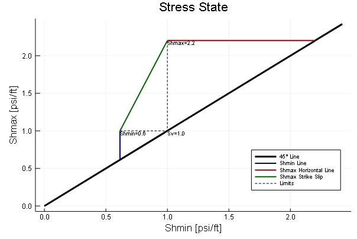

# Geomechanics.jl


## Introduction.
This package is being designed among others to provide Petroleum Engineering tools in a modern programming language. This package is part of the project 7G which  proposes to make basic but powerful engineering software packages that cover the main topics of the Oil and Gas development phases which could be applied to any case study by suitable engineers.

There are five topics in which the project is going to be focused on:

<br>-Geoscience (Current Package)
<br>-Reservoir
<br>-Production
<br>-Economics
<br>-Integration

<br> The package will always be in permanent development and open to suggestions to enhance the program. As the code has been written so far by a code enthusiastic Petroleum Engineer I hope to learn as much as possible to get better and useful programs.

## Geomechanics.jl Description

Geomechanics.jl is a package that allows to make Geomechanics analysis focused on the Unconventional Resources evaluation.

## Stress State

By giving the pressure gradient in Psi/ft of the vertical stress, pore pressure and friction coefficient (Sv, Pp, μ) you can plot a zobackogram which shows the range of stresses.

### Example


## Stress Polygon
```julia
using Geomechanics

Sv=1.0
Pp=0.433
μ=0.6
p1=zobackogram(Sv,Pp,μ, title="Stress State")
```
<br>


## Ternary Plots

You can plot the composition of the rocks by using a ternary plot recipe: 

```julia

SampleA=[.16,0.19,0.65]
SampleB=[0.38,0.55,0.07]
SampleC=[0.3,0.4,0.3]
Data=[SampleA';SampleB']

p1=triplot(Data,1,NodeName=["Clay","Quartz","Calcite"])
p1=triplot!(SampleC',1, markercolor=:green,NodeName=["Clay","Quartz","Calcite"])

p2=triplot(rand(20,3),1,Norm=true)
plot(p1,p2,layout=(1,2), size=(900,400))
```
<br>
